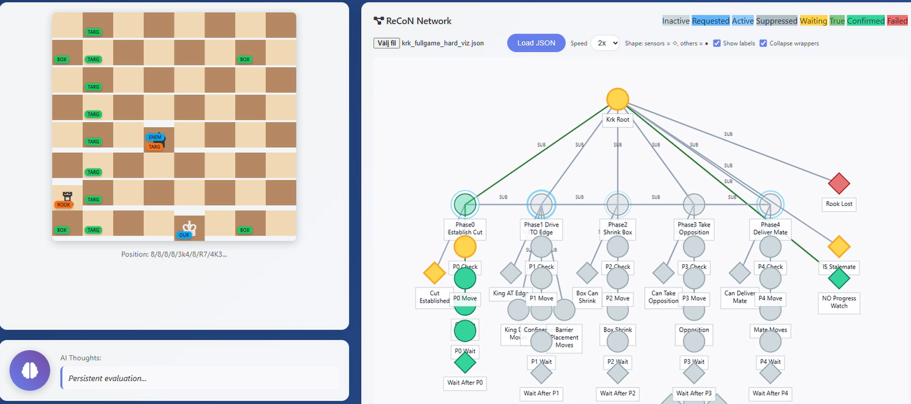
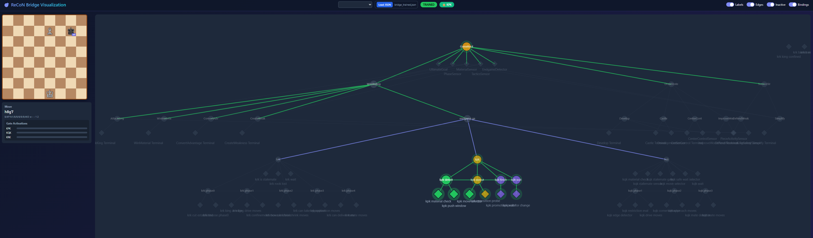
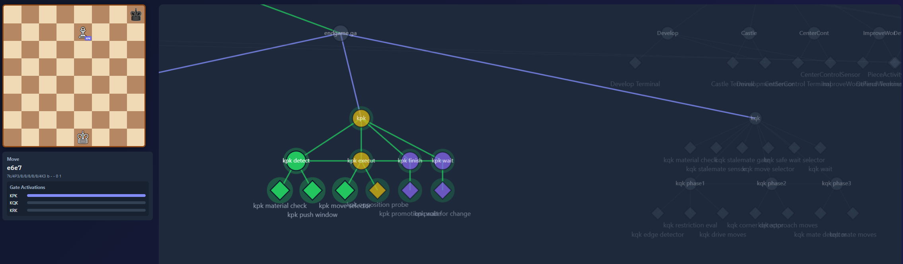
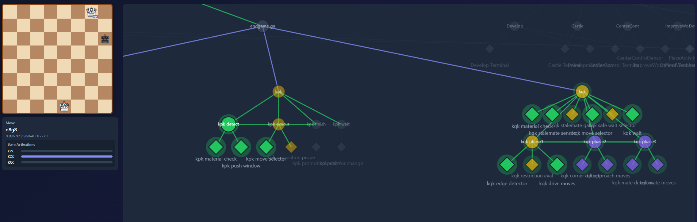

# Hector: A Cognitive Architecture for Structural Deliberation via Request-Confirmation Networks

**Authors**: Oskar Paulander

---

## Abstract

Conventional Reinforcement Learning (RL) often produces "flat" agents that exhibit high performance through reactive heuristics but lack the structural decomposition necessary for genuine deliberation: a disconnect we term the "Prodigy Problem." We present Hector, a cognitive architecture based on Request Confirmation Networks (ReCoN), designed to investigate how hierarchical subgoals and planning horizons can emerge from self-organizing symbolic structures.

Using the adversarial microcosm of chess not as an objective, but as a structured symbolic scaffold, we demonstrate a "White Box" orchestrator capable of autonomous maturation. Hector builds upon a minimal backbone with a Dynamic Stem Cell Layer, where "logical packs" (AND/OR gates, POR sequences) self-organize into hierarchical subgraphs evocative of cortical microcolumns. We detail the "Hector Roadmap": from the visualization of real-time sensory-motor bindings to the "Big Result"—the autonomous chaining of disparate strategic phases (e.g., transition from pawn promotion to checkmate) without hardcoded phase logic.

Our findings demonstrate that the architecture functions as a distributed orchestrator, capable of autonomous strategic handovers without hardcoded phase logic. Benchmarking against standard black-box Reinforcement Learning shows that Hector achieves a 93.2% success rate with 6x greater sample efficiency than Proximal Policy Optimization (PPO) baselines on identical curriculum stages. Furthermore, we present a Proof of Concept for Structural Maturation via Inertia Pruning, where the agent autonomously explores deeper partonomic hierarchies. This dual-pathway approach—combining consolidated modular coordination with dynamic topological growth—offers a concrete instantiation of functional machine intelligence that prioritizes representational transparency over black-box optimization.

---

## I. Introduction: Beyond Reactive Agency

### The Prodigy Problem

Modern deep reinforcement learning has produced agents capable of superhuman performance in games ranging from Go to StarCraft. Yet these "prodigies" exhibit a fundamental limitation: their competence is often a form of superficial "brute-force" matching rather than structural decomposition. Because a neural network can often achieve high reward by simply memorizing complex sensory-motor mappings, it is never "forced" to develop the deeper reasoning chains required for genuine deliberation.

This is akin to a gifted math student who can solve equations intuitively but refuses to "show their work." When asked to simplify an expression, they might say, "I can see immediately that $x = 42$," bypassing the formal steps. While successful in the short term, this lack of structural scaffolding prevents them from tackling problems that exceed their intuitive horizon—and it leaves their "reasoning" entirely opaque to others. 

We call this the **Prodigy Problem**: high-performance competence that lacks the internal structure necessary for inspection, modification, or maturation into complex planning. This aligns with recent calls for a "Third Wave" of Artificial Intelligence (Garcez & Lamb, 2020) that prioritizes the synthesis of neural learning with symbolic reasoning structures.

### Chess as Drosophila Model

We utilize chess as a **drosophila-model** (McCarthy, 1990)—a deterministic environment for quantifying long-range temporal credit assignment and subgoal inference. Our contribution is not "yet another chess engine" but rather a demonstration that:

1. Strategic phase transitions can occur **autonomously** without hardcoded orchestration
2. Hierarchical subgoals can **emerge** from self-organizing symbolic structures
3. Learned structures remain **interpretable** throughout training

### Thesis

We propose that genuine deliberation requires a **Distributed Orchestrator** capable of functional decomposition. Hector, built on the Request-Confirmation Network (ReCoN) formalism, provides such an orchestrator by combining:

- **Top-down goal delegation** (requests flow from abstract goals to concrete sensors)
- **Bottom-up confirmation** (evidence flows from sensors to validate hypotheses)
- **Temporal sequencing** (POR/RET links enforce causal ordering)
- **Structural plasticity** (stem cells discover and solidify new patterns)

**Claim Preview.**
In this work, we demonstrate that a ReCoN-based architecture can function as a distributed deliberative orchestrator: autonomously discovering, coordinating, and handing over between hierarchical subgoals without hardcoded phase logic. Using chess endgames as a controlled symbolic microcosm, Hector exhibits structural maturation through self-organizing subgraphs while remaining fully interpretable throughout training. This establishes a concrete, inspectable alternative to black-box reinforcement learning for studying deliberation and long-horizon control.

---

## II. The ReCoN Formalism: A Grammar of Deliberation

Request Confirmation Networks (Bach & Herger, 2015) provide a neuro-symbolic framework for combining neural computation with hierarchical script execution. We summarize the key concepts and introduce our extensions.

### 2.1 Node Types

ReCoN networks consist of two fundamental node types:

| Type | Definition | Role |
|------|------------|------|
| **SCRIPT** | "A hypothesis requiring validation from sub-elements" | Intermediate goals, scripts, composite patterns |
| **TERMINAL** | "Performs measurement, has activation representing value" | Sensors (read environment) or Actuators (execute actions) |

A SCRIPT node represents a **hypothesis**; a claim about the world that must be validated by its children. For example, "opposition is established" is a hypothesis validated by checking king positions. TERMINAL nodes perform the actual measurements or actions.

> **Note**: These definitions are deliberately abstract. A SCRIPT node could range from a simple logical check to a full Multilayer Perceptron (MLP) or an API call to an external service. Similarly, a TERMINAL node could be a Python function or a physical sensor (e.g., a thermometer) interacting with the real world.

### 2.2 Edge Types

Four directed edge types connect nodes, forming the grammar of deliberation:

| Edge | Direction | Message | Purpose |
|------|-----------|---------|---------|
| **SUB** | Parent → Child | `request` | "I need this subgoal validated" |
| **SUR** | Child → Parent | `wait`, `confirm` | "I'm working" / "I succeeded" |
| **POR** | Predecessor → Successor | `inhibit_request` | "Wait for me before activating" |
| **RET** | Successor → Predecessor | `inhibit_confirm` | "Only I can confirm parent" |

**Critical constraint**: TERMINAL nodes can only receive SUB edges and send SUR edges. POR/RET edges require SCRIPT nodes, enabling temporal sequencing only at the compositional level.

### 2.3 State Machine and Message Passing

Each node implements an 8-state finite machine:

```
INACTIVE → REQUESTED → ACTIVE → WAITING → TRUE → CONFIRMED
                ↓              ↓
           SUPPRESSED       FAILED
```

The state transitions follow message passing rules (Table 1 from Bach & Herger):

| State | POR Sent | RET Sent | SUB Sent | SUR Sent |
|-------|----------|----------|----------|----------|
| INACTIVE | – | – | – | – |
| REQUESTED | inhibit_request | inhibit_confirm | – | wait |
| ACTIVE | inhibit_request | inhibit_confirm | request | wait |
| SUPPRESSED | inhibit_request | inhibit_confirm | – | – |
| WAITING | inhibit_request | inhibit_confirm | request | wait |
| TRUE | – | inhibit_confirm | – | – |
| CONFIRMED | – | inhibit_confirm | – | confirm |
| FAILED | inhibit_request | inhibit_confirm | – | – |

### 2.4 The Inhibit-Confirm Mechanism

The **inhibit_confirm** signal via RET links is what enables POR-chains to function as sequences rather than parallel alternatives. Structurally, RET links allow a parent SCRIPT to remain in the **WAITING** state rather than transitioning immediately to TRUE/CONFIRMED upon the first sub-element's success.

> "Each unit sends an 'inhibit confirm' signal via RET to its predecessors. The last unit in a sequence will not receive an 'inhibit confirm' signal, and can turn into the state 'confirmed'." (Bach & Herger, 2015)

In a sequence `A → B → C` (POR ordering), only node C can confirm the parent. This mechanism is crucial for deliberation: it prevents Hector from "exiting early" during scenarios like **Zugzwang**, where multiple intermediate steps must be held in tension. It forces the system to maintain the parent node's active state until the entire POR sequence confirms, ensuring that the strategic deliberation persists through the necessary temporal horizon.

### 2.5 Top-Down/Bottom-Up Integration

ReCoN achieves the integration of top-down and bottom-up processing that characterizes biological cognition:

- **Top-down**: Requests propagate from abstract goals (e.g., "promote pawn") through SUB links to concrete sensors (e.g., "check if path is clear")
- **Bottom-up**: Confirmations propagate from sensors through SUR links, validating hypotheses at each level

This bidirectional flow allows the network to both predict (top-down) and verify (bottom-up); a requirement for robust perception and action.

---

## III. Hector's Roadmap: Developmental Scaffolding

Hector's development proceeded through major phases, divided into milestones Mk, each building capabilities for the next. The first stage simply executed heuristics, implemented in a discrete, hand crafted, ReCoN network. After this we let the network learn increasingly challenging tasks and attributes; first selecting plans between hand-coded solver, then solving tasks based solely on terminal inputs and subgoal activations. Lastly, we aim to let the network learn the structure of the graph,effectively creating its own terminals and intermediate goals. 

### 3.1 Fixed-Topology Phase (M1-M4): Modular Coordination

The first phase established that ReCoN could orchestrate modular subgoals with learned coordination.

#### M1-M2: Continuous Activations and Weighted Subgraph Packs

We extended the discrete ReCoN formalism with:

- **Continuous activations**: Node activation values in $[0, 1]$ rather than binary, enabling "fuzzy" strategic weighting.
- **Weighted edges**: `SUB`/`SUR` edges carry learnable weights, functioning as **Strategic Priors**. This allows the system to build a preference ranking (e.g., prioritizing "Opposition" over "Push") before any structural changes occur. 
- **Subgraph Weight Packs (SWPs)**: Groups of edges whose weights are trained together as a coherent behavior unit.

For researchers, this transition effectively transforms the ReCoN graph from a rigid boolean switch into a **differentiable decision tree**. By modulating the activation levels flowing down the hierarchy, Hector can learn to "weigh" competing subgoals based on their historical contribution to reward, providing a level of plasticity similar to neural networks while maintaining the symbolic interpretability of the graph nodes. This allows the network to learn *which* strategies to prefer in different situations, even before structure learning.

#### M3: Fast Plasticity

Within-game weight updates via eligibility traces:

```
Δw = α × eligibility × reward
```

When a move leads to a successful outcome, all edges that fired during that decision receive a weight boost. This is analogous to biological synaptic potentiation. This enables rapid, context-sensitive adaptation within a single game, allowing Hector to reinforce subgoal selections that immediately contribute to successful outcomes.

#### M4: Slow Consolidation

Cross-game aggregation of weight changes:

```
w_base ← (1-β) × w_base + β × mean(Δw_episodes)
```

This prevents catastrophic forgetting and allows gradual refinement over many games. By separating fast within-game plasticity from slow cross-game consolidation, the architecture stabilizes useful coordination patterns while remaining responsive to novel configurations.

#### The Big Result: KPK → KQK Handover

Using these mechanisms, we demonstrated **autonomous strategic handovers**: a unified topology containing both King-Pawn-vs-King (KPK) and King-Queen-vs-King (KQK) subgraphs could transition from pawn promotion strategy to checkmate strategy **without hardcoded phase detection**, as shown in section IV. 

The transition occurs naturally through activation dynamics:
- **Seamless Activation Flow**: As KPK goals (Promotion) are satisfied, their activation drops, allowing KQK goals (Checkmate) to rise as their sensors detect the new Queen. 
- **Seamless Handover**: Because activations propagate via parallel microticks within a single engine step, there is no discrete "phase switch" or sensing lag, KQK becomes active for white's next move.
- **Activation-Driven Logic**: No explicit "if pawn promoted" code exists. The network simply settles into the most relevant strategic state based on real-time environmental evidence.

### 3.2 Maturation Stage (M5): Structural Learning

To address the **Prodigy Problem** at its root, Hector must go beyond mere parameter tuning and engage in **Structural Maturation**. While M3/M4 plasticity optimizes the *relative importance* of existing concepts, the M5 evolution system allows the agent to *discover* new ones. We hypothesize that genuine intelligence requires the ability to autonomously expand its own topological "grammar" when existing structures fail to resolve strategic plateaus. While M1–M4 provide a stable backbone of learned weights, M5 moves toward a breakthrough in structural agency, allowing Hector to transition from a fixed script-follower to a self-organizing system that discovers its own tactical reasoning trees.

The maturation phase replaces hand-designed sensor nodes with self-discovering **stem cells**, enabling the ReCoN graph to autonomously grow its own topology. This process represents the agent "showing its work"— externalizing its learned correlations into persistent, inspectable symbolic structures. M5 is currently in an exploratory phase. Results are promising but balancing recursive growth with XP survival remains an active area of investigation.

#### The Stem Cell Lifecycle

Inspired by evolution (and mirroring biological neural development), we implemented a XP driven selection process for sensor nodes:

```
EXPLORING → CANDIDATE → TRIAL → MATURE
                           ↓
                       DEMOTED (XP ≤ 0)
```

| State | Description | Survival Criterion |
|-------|-------------|-------------------|
| EXPLORING | Collects samples during high-reward moments | Collect ≥50 samples |
| CANDIDATE | Has enough data, awaiting trial | Survive 2+ cycles |
| TRIAL | Transient node in graph, earns XP | XP ≥ 100 to solidify |
| MATURE | Permanent node in topology | N/A |

#### XP System

TRIAL nodes earn or lose Experience Points based on their contribution to wins, e.g.:

| Event | XP Change |
|-------|-----------|
| Positive affordance delta (win) | +10 XP |
| Negative affordance delta (loss) | -10 XP |
| Per-cycle decay (cost of living) | -1 XP |
| Solidification threshold | 100 XP |
| Demotion threshold | 0 XP |

#### The FeatureHub: A Global Knowledge Bank

To enable transfer learning between different strategic contexts (e.g., from King-Rook mate to King-Pawn promotion), Hector utilizes a **FeatureHub**. This centralized registry "hoists" discovered tactical patterns, such as *Opposition Status* or *Back-Rank Weakness*, making them available globally. 

When a stem cell discovers a relevant pattern in the KRK endgame, that pattern is registered in the Hub. Because the Hub is shared across the entire architecture, the KPK subgraphs can immediately "test" this known feature as a potential sensor for their own goals. This effectively provides Hector with a **Collective Working Memory**, where successful cognitive primitives are shared across the hierarchy.

#### Inertia Pruning: Bayesian Metabolic Control

To ensure structural efficiency, we implement **Inertia Pruning** as a Bayesian filter for Causal Significance. Inertia Pruning functions as a metabolic constraint, where nodes that fail to provide a consistent Information Gain over the win-probability ($P(Win|Sensor) - P(Win)$) are evaporated from the topology. This ensures that the resulting graph is not just a collection of correlations, but a sparse set of causal affordances. This prevents the "topology bloat" that often plagues additive learning systems.

#### Pack Templates: AND/OR Gates

When TRIAL cells demonstrate consistent coactivation (≥85% correlation in wins), they are hoisted into **AND-gate packs**:

```
parent (SCRIPT)
  └─ SUB → gate (SCRIPT, aggregation="min")     
            └─ SUB → sensor_A (TERMINAL)
            └─ SUB → sensor_B (TERMINAL)
            └─ POR → action (SCRIPT)            
                      └─ SUB → actuator (TERMINAL)
```

The AND-gate fires only when ALL child sensors fire—enabling compositional pattern detection (e.g., "opposition AND path clear → push").

#### Vertical Growth: Depth 3+ Hierarchies

Initially, all TRIAL nodes attached to backbone nodes (depth 1-2). We extended the system to spawn packs **under existing packs**, creating true hierarchies:

```
Depth 1: kpk_execute (backbone)
Depth 2: TRIAL_opposition_sensor
Depth 3: AND-gate combining multiple sensors
Depth 4: Nested AND-gate for multi-condition patterns
```

Log output demonstrating deep spawning:
```
[LINK] AND-gate spawned (L1): and_stem_0002_gate
[TREE] AND-gate spawned (deep under and_stem_0002_gate): and_stem_0004_deep_gate
```

---

## IV. Interpretability: Visualizing the Binding Mechanism

A key advantage of ReCoN over black-box approaches is inherent interpretability.

### 4.1 The "Window into Mental Model"

Our visualization system renders:
- **Node activations** as color intensity (grey = inactive, green = active)
- **Edge weights** as line thickness
- **State machine states** as node colors
- **Node types** as node shapes (circular scripts, diamond terminals)
- **Bindings** as tags on the chessboard; representing what relevant terminal sensors "look" at. 


Single game view of the heuristics driven ReCoN graph, showing node activations, edge weights, and bindings.


This real-time visualization represents the agent's instantiated **focus of attention** within a broader **working memory architecture**. Structurally, Hector serves as a concrete instantiation of **Global Workspace Theory** (Baars, 1988), where specialized ReCoN subgraphs compete for access to the motor system.

Unlike PPO, where state is transient and latent, Hector’s "Mental Model" is a persistent topological structure. Here, we can observe the literal **binding** of abstract concepts (like "Opposition") to physical board coordinates, maintained as an active state in the network's cognitive registers (Cowan, 2001). When a specific node "lights up," we are observing selective attention—a "spotlight" that selects which sub-goals or sensors are currently task-relevant. Top-down REQUEST signals represent attentional control, while the persistent structure of the ReCoN graph functions as working memory, keeping information available for manipulation over time.

### 4.2 Activation Graph and Strategic Handover

During the KPK→KQK transition, the visualization system provides a real-time "fingerprint" of the agent's shifting strategic priorities (above). Unlike black-box weight matrices, the ReCoN topology reveals the precise moment the distributed orchestrator reallocates requests based on environmental affordance spikes.

To understand Hector’s deliberation, one must observe the global-to-local flow of requests. The following visualization sequence demonstrates the "Spotlight of Attention" as it moves through the ReCoN hierarchy during a live endgame transition.

#### **I. Global Orchestration Context**

ReCoN has a top down goal driven architecture, with bottom up sensor driven feedback.
The root node represents the high level goal **"Win Game."** This goal propagates requests down through several parallel strategic subgraphs, including King-Pawn (KPK), King-Queen (KQK), and King-Rook (KRK) endgames. Based on the board state, the ReCoN graph dynamically request the most relevant strategic subgraph to activate.



**Figure 1: Global Strategic Hierarchy.** Note that while all strategic legs (KPK, KQK, KRK) are technically "called" by their common parent, only the task-relevant sub-branch remains active. The inactive branches stay dormant in a "suppressed" or "inactive" state because their environmental sensors (e.g., "Is there a Rook on board?") fail to provide the necessary affordance for activation.

---

#### **II. Phase A: Pawn Promotion (Local Detail)**

As the agent enters the final stages of a pawn push, the orchestrator focuses exclusively on the KPK sub-hierarchy.



**Figure 2: KPK Leg Dominance.** In this state, the KPK subleg is active; the top SCRIPT node (which has goal "promote pawn") is yellow (Requested, Waiting for children to complete), driven by active terminal nodes that specifically monitor pawn-relevant features like `kpk material check` and `kpk push window`. The neighboring KQK branch is rendered in gray, indicating it is currently irrelevant to the board state and is not being requested.

---

#### **III. Phase B: Post-Promotion Handover (Local Detail)**

The precise moment the pawn promotes to a Queen, the internal mental model undergoes a functionally instantaneous shift.



**Figure 3: KQK Leg Activation.** Following promotion, the `affordance_kpk` sensor immediately drops to zero, causing the KPK leg to collapse. Simultaneously, the `kqk material check` sensor spikes, satisfying the pre-conditions for the KQK leg. The orchestrator redirects requests to these new, specialized, subgoals—such as `kqk mate detector` and `kqk drive moves` to deliver the final checkmate.


### 4.3 Topology Timelapse 

For M5 worke, we record topology snapshots at each training cycle, enabling timelapse visualization of structural growth. The evolution from a single backbone node to a 45+ node hierarchical structure demonstrates the emergence of tactical knowledge. See supplementary timelapse video for details.

## V. Experiments and Results

### 5.1 Experimental Setup

#### Environment
King-Pawn vs King (KPK) endgame with:
- **Observation**: 64-dimensional vector (piece positions)
- **Actions**: Legal moves from current position
- **Reward**: +1 win, -1 loss, 0 draw, +0.5 promotion

#### Curriculum
Following the principles of **Curriculum Learning** (Bengio et al., 2009), we utilize an 8-stage curriculum from easy to hard positions:

| Stage | Description | Challenge |
|-------|-------------|-----------|
| 0 | SPRINTER | Pawn on 7th rank, king far |
| 1-5 | Discovery Bridge | Incremental challenges |
| 6 | ESCORT | King support required |
| 7 | KEY_SQUARES | Full opposition dynamics |

#### Baseline
PPO (Stable-Baselines3) with identical observation/action/reward setup:
- MlpPolicy (2-layer neural network)
- 50,000 training timesteps
- Standard hyperparameters (lr=3e-4, γ=0.99)

### 5.2 KPK Curriculum Results

| Metric | PPO | ReCoN (Hector) |
|--------|-----|----------------|
| Stage 7 Win Rate | ~20% | **93.2%** |
| Training Samples | 50,000 | 8,000 |
| Training Time | ~5 min | ~3 min |
| Interpretable | No | **Yes** |

**Sample Efficiency**: ReCoN achieves 93% win rate with **6x fewer samples** than PPO achieves 20%.

### 5.3 Structural Growth

Final topology statistics from `kpk_hybrid_growth/stage7`:

| Metric | Value |
|--------|-------|
| Total active nodes | 152 |
| Pack nodes (AND/OR gates) | 45 |
| Maximum depth | 4 |
| TRIAL → MATURE promotions | 12 |
| Inertia-pruned cells | 58 |

The emergence of 45 pack nodes demonstrates **causal discovery**—the network identified and solidified patterns that predict wins.

### 5.4 KPK → KQK Handover

Using pre-trained unified topology with both endgame subgraphs:

| Metric | Value |
|--------|-------|
| Successful handovers | 100% |
| Handover latency | 1 move |
| Hardcoded phase logic | **None** |

The transition occurs via activation dynamics, demonstrating autonomous strategic orchestration.

---

## VI. Discussion

### What's Hardcoded vs. Learned

| Component | Hardcoded | Learned |
|-----------|-----------|---------|
| Chess rules (legal moves) | Yes | |
| Piece categorization (pawn/king) | Yes | |
| Goal (promote = win) | Yes | |
| Move selection | | Yes |
| Pattern discovery | | Yes |
| Topology structure | | Yes |

**The defensible claim**: Given only legal moves and win/loss rewards, Hector autonomously discovers hierarchical patterns corresponding to known chess theory (opposition, key squares, timing) without being programmed with those concepts. By mapping these patterns onto a transparent ReCoN topology, we move away from black-box heuristics toward a **structural deliberation** that is inspectable and verifiable.

### Structural Deliberation vs. Search-Driven Opportunism

A critical distinction must be made between Hector and traditional "brute-force" engines like Stockfish. Stockfish achieves superhuman performance through high-speed alpha-beta search; 
an approach we characterize as search-driven opportunism. It does not "understand" a strategic plan; rather, it identifies the mathematically optimal move by forecasting millions of future states.

In contrast, Hector utilizes structural deliberation. It does not rely on deep look-ahead trees to find a move; instead, it relies on a distributed orchestrator to identify the most relevant "mental model" for the current board state. Where Stockfish is a "Black Box" of exponential calculation, Hector is a "White Box" of hierarchical subgoals. Even without the search depth of traditional engines, Hector demonstrates that strategic competence can emerge from the self-organization of compositional agency, providing a transparent path toward machine intelligence that "shows its work".

### Limitations

1. **Information Gain in High-Draw Environments**: While M5 successfully discovers patterns in high-reward endgames (KPK), credit assignment in complex endgames like KRK remains challenging. Overcoming "sample starvation" in draw-heavy environments currently requires reward shaping (Draw Scent) for structural discovery to converge.
2. **Knowledge Persistence vs. Pruning**: While the network can grow hierarchical structures (depth 3-5+), the current "metabolic pruning" mechanism is still maturing. There is a tension between preserving learned affordances and removing redundant nodes that correlate but do not provide unique Information Gain.
3. **Tactical Precision vs. Strategic Orchestration**: Hector excels at hierarchical deliberation but does not yet natively incorporate deep look-ahead search. For complex middle-game combinations, a hybrid approach combining ReCoN with traditional search may be necessary.
<!-- TODO: Mention that M5 results are characterized as an exploratory frontier with promising early results in depth discovery. -->

### Outlook and Future Work

The developmental trajectory of Hector suggests that hierarchical structural deliberation can scale through both autonomous discovery and architectural compilation. We identify three primary avenues for future expansion:

#### **1. Structural Maturation and Recursive Branching**
Future iterations will focus on **Recursive Branching**, where "Stem Cell Spawn Points" attached to mature SCRIPT nodes autonomously generate child sub-graphs. This mechanism aims to bridge the gap between high-level strategic orchestration and low-level tactical verification. Parallel research into **Dynamic Metabolic Pruning** will refine the Bayesian "Inertia" filters to ensure these deeper hierarchies remain sparse and causal, evaporating redundant branches without regressing win rates.


#### **2. Preliminary Validation: Compiler-Driven Scaling**
Initial results suggest that pre-trained sensory-motor patterns can be compiled into fixed ReCoN topologies to serve as high-precision strategic backbones. Preliminary tests on the KRK endgame have already demonstrated that these **compiled micro-scripts** can achieve near-perfect tactical precision. We intend to extend this validation to KQK and more complex adversarial endgames to prove the framework’s ability to scale beyond the initial "Discovery Bridge" curriculum.

#### **3. Cognitive Scaling: Search-Guided Activation**
To achieve high-precision reasoning in the middle-game, we propose a "Thinking Fast and Slow" hybrid architecture (Kahneman, 2011):

* **System 1 (Strategic Bias):** The active ReCoN topology acts as a white-box evaluator, providing structured priors that focus search energy on task-relevant subgoals (e.g., "Shouldering") rather than raw move-space.
* **System 2 (Tactical Verification):** Monte Carlo Tree Search (MCTS) functions as an internal "verification script" within the ReCoN hierarchy. A parent node enters a `WAITING` state while the MCTS terminal validates the tactical feasibility of a plan, returning `CONFIRM/FAILED` signals based on simulation outcomes.
* **Explainable Value:** Unlike black-box search, every move decision remains traceable to specific activated subgoals, providing a path to high-precision reasoning that remains fully inspectable.

---

## VII. Conclusion: Toward Structured Control

We have presented Hector, a cognitive architecture demonstrating that:

1. **Hierarchical subgoals can emerge** from self-organizing stem cells under Darwinian selection
2. **Strategic phase transitions occur autonomously** via activation dynamics rather than hardcoded orchestration
3. **Learned structures remain interpretable** throughout training, addressing the Prodigy Problem

ReCoN provides a general-purpose framework for structured control. While demonstrated here on chess endgames, the formalism applies to any domain requiring:
- Compositional reasoning (AND/OR gates)
- Temporal sequencing (POR chains)
- Top-down/Bottom-up integration
- Representational transparency

By prioritizing structural decomposition over raw performance, Hector offers a path from "game playing" to **autonomous deliberation** in open-world tasks.

---

## References

1. **Bach, J., & Herger, P. (2015).** Request Confirmation Networks for Neuro-Symbolic Script Execution. *Proceedings of the 28th International Conference on Neural Information Processing Systems*.

2. **McCarthy, J. (1990).** Chess as the Drosophila of AI. *In Finding a Solution of a Problem: A Festschrift for Robert K. Lindsay*.

3. **Garcez, A. S. D., & Lamb, L. C. (2020).** Neurosymbolic AI: The 3rd Wave. *arXiv preprint arXiv:2012.05876*.

4. **Bengio, Y., Louradour, J., Collobert, R., & Weston, J. (2009).** Curriculum Learning. *Proceedings of the 26th Annual International Conference on Machine Learning*.

5. **Baars, B. J. (1988).** *A Cognitive Theory of Consciousness*. Cambridge University Press.

6. **Cowan, N. (2001).** The magical number 4 in short-term memory: A reconsideration of mental storage capacity and its adaptive value. *Behavioral and Brain Sciences*.

7. **Schulman, J., et al. (2017).** Proximal Policy Optimization Algorithms. *arXiv:1707.06347*.

8. **Kahneman, D. (2011).** *Thinking, Fast and Slow*. Farrar, Straus and Giroux.

---

## Appendix A: ReCoN State Machine Complete Table

The Hector engine implements the standard ReCoN state machine (Bach & Herger, 2015) with an 8-state transition logic. Transitions occur at discrete clock ticks based on top-down requests and bottom-up confirmations.

| Current State | Condition | Next State | Action |
|---------------|-----------|------------|--------|
| **INACTIVE** | Receives `REQUEST` from SUB parent | **REQUESTED** | Initialize `tick_entered` |
| **REQUESTED** | Clock tick | **WAITING** | Dispatch requests to children (SUB/POR) |
| **WAITING** | All children `CONFIRMED` OR sensor `TRUE` | **TRUE** | Prepare confirmation signal |
| **TRUE** | Clock tick | **CONFIRMED** | Broadcast `CONFIRM` to parent & `RET` neighbors |
| **WAITING** | Sensor `FALSE` OR child `FAILED` | **FAILED** | Broadcast failure up hierarchy |
| **ACTIVE** | (Used in continuous activation settling) | **WAITING** | Maintain state during propagation |
| **SUPPRESSED** | `POR` predecessor not yet `CONFIRMED` | **INACTIVE** | Hold request until sequence reaches node |

### Transition Logic:
- **Horizontal inhibition**: RET links from successors send `inhibit_confirm` to predecessors, keeping the parent in the `WAITING` state until the final element of a sequence confirms.
- **Top-Down Drive**: Requests flow down `SUB` links; child nodes remain `INACTIVE` until their specific `POR` predecessors reach `CONFIRMED`.
- **Bottom-Up Confirmation**: Once a leaf (TERMINAL) satisfies its predicate, it transitions to `TRUE` → `CONFIRMED`, propagating the signal up `SUR` links to the parent SCRIPT.

## Appendix B: Hector Topology Specification

Hector utilizes a JSON-based snapshot format to persist its learned topology. This format captures the full graph state, including dynamically spawned stem cells, AND/OR gates, and POR-chains.

```json
{
  "nodes": {
    "node_id": {
      "id": "string",
      "type": "SCRIPT | TERMINAL",
      "meta": {
        "subgraph": "main | kpk | krk",
        "layer": "string",
        "aggregation": "avg | and",
        "require_child_confirm": "boolean"
      }
    }
  },
  "edges": {
    "src->dst:TYPE": {
      "src": "string (node_id)",
      "dst": "string (node_id)",
      "type": "SUB | SUR | POR | RET",
      "weight": "float",
      "meta": {
        "trainable": "boolean"
      }
    }
  }
}
```

### Key Metadata Fields:
- **`aggregation`**: Determines how script nodes combine child confirmations (Default: weighted average; "and" for logical gates).
- **`require_child_confirm`**: Enforces "Gating" where an actuator (e.g., kpk_execute) cannot fire until its children provide a confirmation signal.
- **`trainable`**: Flag indicating if the edge weight is subject to M3/M4 plasticity.

## Appendix C: Experimental Logs

Sample output from the `evolution_driver.py` during a hybrid growth run (M5 enabled). The log demonstrates the transition between the Online Phase (playing games) and the Structural Phase (growing topology).

```yaml
--- Cycle 29/30 ---
  Online Phase: Playing 200 games...
    Win rate: 100.0% (Stage 6: ESCORT)
  Structural Phase: Analyzing 200 traces...
    [M5] [SEED] GROWTH MODE: 100% Win Rate detected.
    [M5] Analyzing affordance spikes...
    [M5] [TREE] VERTICAL GROWTH: Spawning under active gate: and_stem_0080_1_gate
    [M5] [LINK] AND-gate spawned (deep): and_stem_0080_2_gate
    [M5] [LINK] OR-gate spawned (L1): or_stem_0080_3_gate
    [M5] [PRUNING] Evaporated node TRIAL_stem_0042 (Inertia < 0.05)
    
    Graph Status: 154 active nodes, 412 edges
    Snapshot saved to: snapshots/evolution/kpk_hybrid/cycle_0029.json
```


